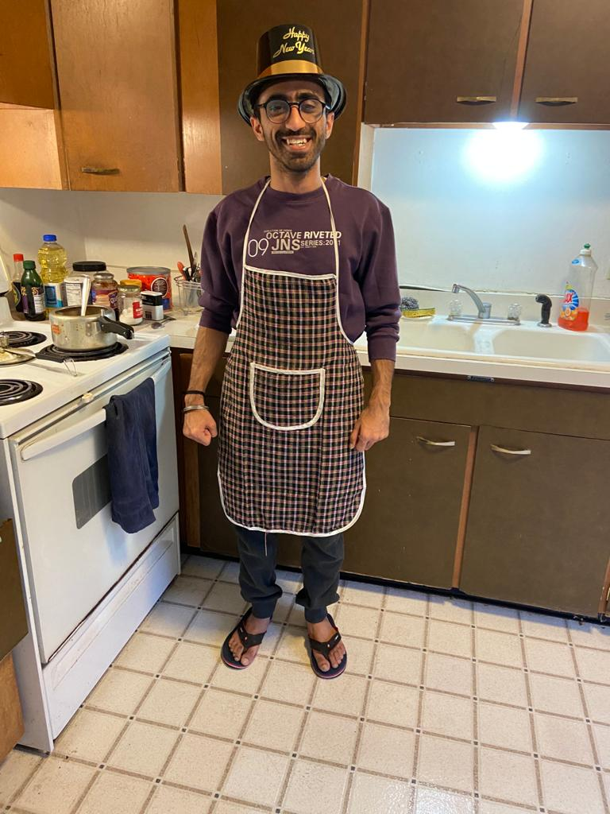
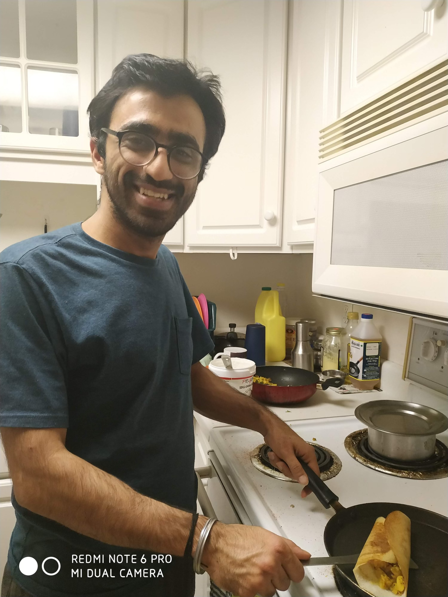
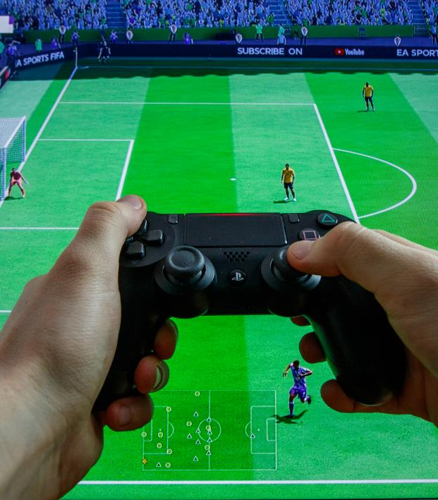
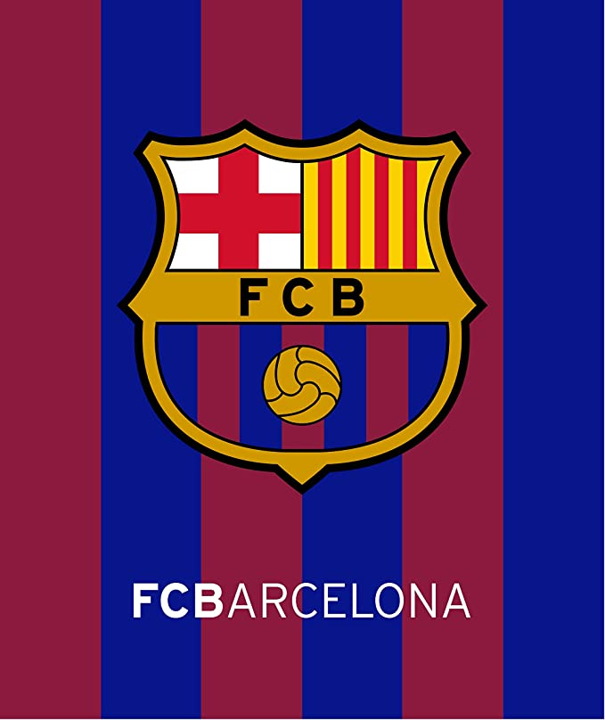

  

    <h1>Hobbies</h1>
    <em>Things I like to do in my free time </em>
  

 
  

  
  
  
  

  

     <em>Hiking </em>
  

              
  

  
  
  
  

  

     <em>Cooking </em>
  

              
  

  
  
  
  

  

     <em>Soccer (Watching and gaming) </em>
  

