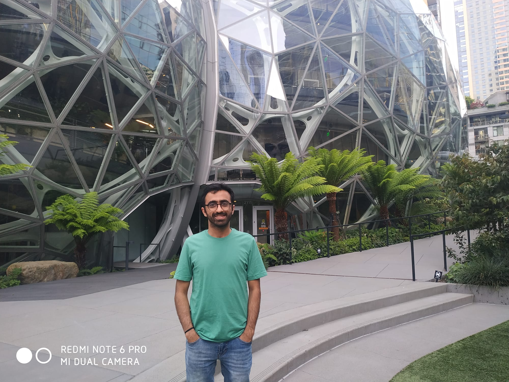
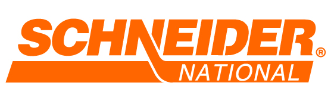

  

    <h1>Internships</h1>
    <em>Some amazing internships I have done during my PhD </em>
  

 
  

  
  

##### **Amazon, Seattle, WA, May-Aug, 2022**
 - Learning framework for reducing search space for a network design problem
 - Tools and technologies used: Graph Neural Networks, PyTorch, Sagemaker, Python

 

##### **Amazon, Virtual, June-Aug, 2021**
  

  
  

 - Decomposition based solution approach for network design in middle mile domain
 - Tools and technologies: Java

 
##### **Schneider National, Greenbay, WI, June-Aug, 2020**
  

  
  

 - Cost forecasting model to predict carrier truckload freight rates in spot market
 - Tools and technologies used: Python, SQL, Time series forecasting
 
